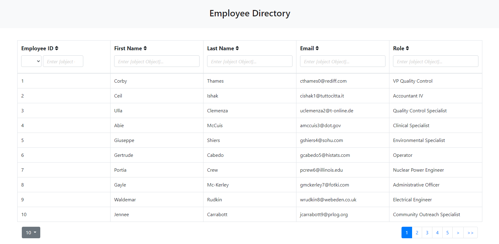

# Employee Directory

## Description
React App that allows users to sort and filter employees in a directory to gain quick access to their information. Employee data was randomly generated using [Mockaroo](https://www.mockaroo.com/)

## Table of Contents
1. [Installation](#Installation)
2. [Usage](#Usage)
3. [License](#License)
4. [Contribution](#Contribution)
5. [Questions](#Questions)

## Installation
None - this app can be viewed live here: https://cr-53.github.io/Employee-Directory/

## Usage
Click on the table header cells to sort. Type in any of the table header cells to filter that column.

## License
GPL  
 

## Contribution
Currently not open for contributions.

## Tests
None.

## Questions
You can view my GitHub profile here: https://github.com/CR-53 
If you have any questions, feel free to send me an email: chrisroschi53@gmail.com
